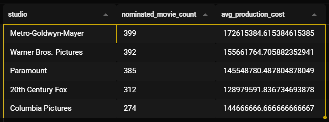
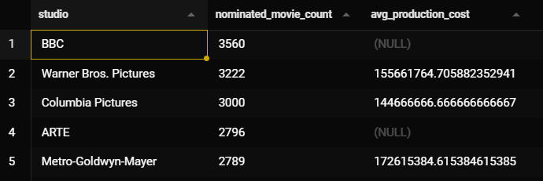

**PROBLEM 1**

*Which studio makes the most movies?* Answer: BBC with 3560

```sql

WITH 
  movie_studios AS (
    SELECT m.id AS id, m.name as name, m.date AS year, s.studio AS studio
    FROM final_project.lbx_movies AS m
    JOIN final_project.lbx_studios AS s ON s.id = m.id
  )
SELECT studio, COUNT(DISTINCT id) as movie_count
FROM movie_studios
GROUP BY studio
ORDER BY movie_count DESC

```

*Which studio makes the most nominated movies* Be careful not to double count movies nominated in multiple categories
Answer: Metro-Goldwyn-Mayer, 399 movies

```sql

WITH 
  movie_studios AS (
    SELECT m.id AS id, m.name as name, m.date AS year, s.studio AS studio, CASE WHEN COUNT(o.winner) > 0 THEN 1 ELSE 0 END AS is_nominated
    FROM final_project.lbx_movies AS m
    JOIN final_project.lbx_studios AS s ON s.id = m.id
    LEFT JOIN final_project.oscar_data AS o On o.film = m.name
    GROUP BY m.id, m.name, m.date, s.studio
  )
SELECT studio, SUM(is_nominated) as nominated_movie_count
FROM movie_studios
GROUP BY studio
ORDER BY nominated_movie_count DESC

```
**PROBLEM 2**

*Which Movies have a Buget of Over $300 Million?* Answer: Avengers End Game, Pirates of the Carribbean, Avengers Age of Ultron, Infinity War, Justice League, and Spectre


```sql

SELECT m.name, t.production_cost
FROM final_project.lbx_movies as m
LEFT JOIN final_project.top_500_mov as t ON m.name = t.title AND m.date = t.year::int AND m.minute BETWEEN (t.runtime::int - 20) AND (t.runtime::int + 20)
WHERE t.title IS NOT NULL AND t.production_cost::int >= 300000000
ORDER BY t.production_cost DESC

```

*Which of those Movies have actually won the Oscars?* Answer: Only Spectre

```sql

SELECT m.name, t.production_cost, o.winner
FROM final_project.lbx_movies as m
LEFT JOIN final_project.oscar_data AS o ON o.film = m.name
LEFT JOIN final_project.top_500_mov as t ON m.name = t.title AND m.date = t.year::int AND m.minute BETWEEN (t.runtime::int - 20) AND (t.runtime::int + 20)
WHERE t.title IS NOT NULL AND t.production_cost::int >= 300000000
ORDER BY t.production_cost DESC

```
**PROBLEM 3**


*Which country was most successful at winning Oscars* United States

```sql

SELECT c.country, COUNT(*)
FROM final_project.lbx_movies AS m
JOIN final_project.lbx_countries AS c ON m.id = c.id
LEFT JOIN final_project.oscar_data AS o ON o.film = m.name
WHERE o.winner IS TRUE
GROUP BY c.country
ORDER BY count DESC

```

**PROBLEM 4**

*What was the average production cost per studio for all nominated movies?* Answer:


```sql
WITH 
  movie_studios AS (
    SELECT m.id AS id, m.name as name, m.date AS year, s.studio AS studio, CASE WHEN COUNT(o.winner) > 0 THEN 1 ELSE 0 END AS is_nominated, AVG(t.production_cost::int) AS prd_cost
    FROM final_project.lbx_movies AS m
    JOIN final_project.lbx_studios AS s ON s.id = m.id
    LEFT JOIN final_project.oscar_data AS o On o.film = m.name
    LEFT JOIN final_project.top_500_mov as t ON m.name = t.title AND m.date = t.year::int AND m.minute BETWEEN (t.runtime::int - 20) AND (t.runtime::int + 20)
    GROUP BY m.id, m.name, m.date, s.studio
  )
SELECT studio, SUM(is_nominated) AS nominated_movie_count, AVG(prd_cost) AS avg_production_cost
FROM movie_studios
GROUP BY studio
ORDER BY nominated_movie_count DESC


```

*What was the averag production cost per studio for all winning movies?* Answer


```sql

WITH 
  movie_studios AS (
    SELECT m.id AS id, m.name as name, m.date AS year, s.studio AS studio, CASE WHEN COUNT(o.winner IS TRUE) > 0 THEN 1 ELSE 0 END AS is_nominated, AVG(t.production_cost::int) AS prd_cost
    FROM final_project.lbx_movies AS m
    JOIN final_project.lbx_studios AS s ON s.id = m.id
    LEFT JOIN final_project.oscar_data AS o On o.film = m.name
    LEFT JOIN final_project.top_500_mov as t ON m.name = t.title AND m.date = t.year::int AND m.minute BETWEEN (t.runtime::int - 20) AND (t.runtime::int + 20)
    GROUP BY m.id, m.name, m.date, s.studio
  )
SELECT studio, SUM(is_nominated) AS nominated_movie_count, AVG(prd_cost) AS avg_production_cost
FROM movie_studios
GROUP BY studio
ORDER BY nominated_movie_count DESC


```